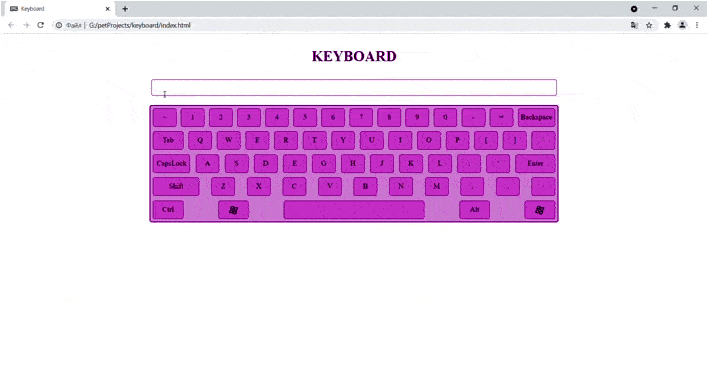
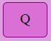
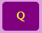
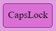

# :keyboard: [KEYBOARD](daria-zaiets.github.io/keyboard/)

Mini project "web-keyboard" with reaction to keystrokes on your keyboard.

:link:  daria-zaiets.github.io/keyboard/ 

This project is my mini-project to consolidate knowledge on the topic "Keyboard events in js".

## :electric_plug:  **How to use** :bulb:
Enter characters in the input field on the page. Each time you press a key, the corresponding keys on the page will change color. And when released, they will return to the initial stage.

initial stage|press a key| release a key
------------- | ------------- | ------------- 
 |  |   

The exception is CapsLock. It only changes color when pressed.
initial stage|press a key| release a key
------------- | ------------- | ------------- 
 |  | 
## :wrench: **Project setup** :hammer:  

You can see the project by the *[link](daria-zaiets.github.io/keyboard/)*.

You also can clone this repo and open in your favorite browser `index.html` file.

## :love_letter: Contact the author :mailbox_with_no_mail:
:email: zaiets.dar@gmail.com